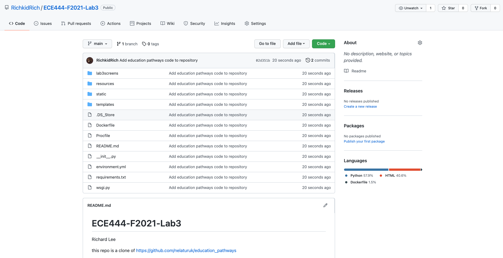
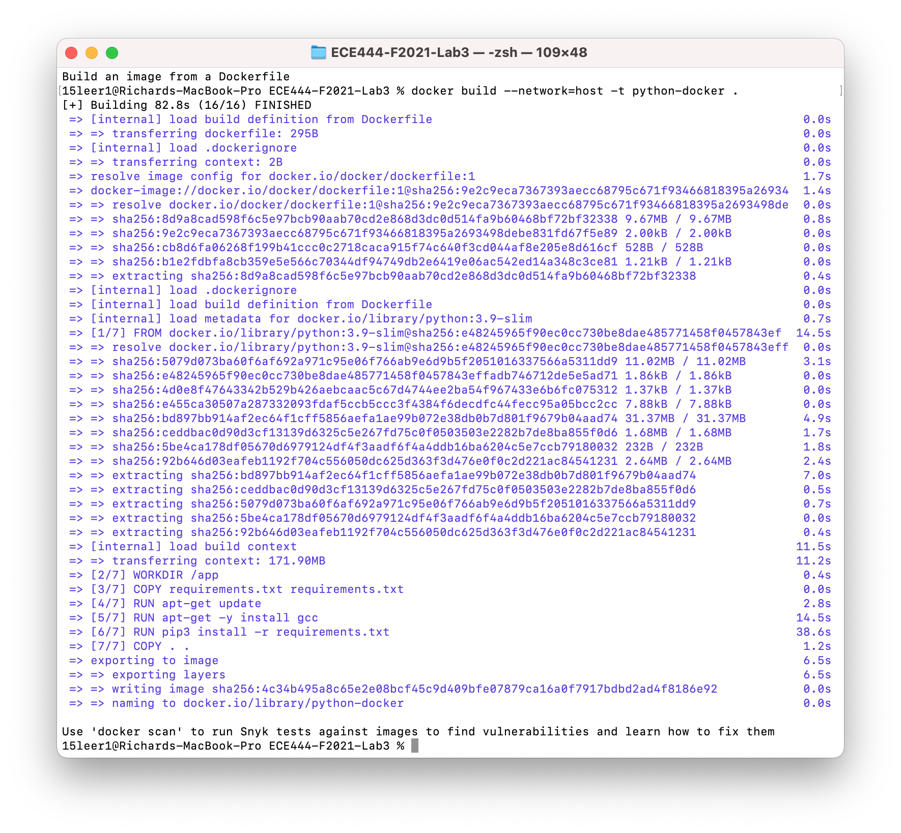
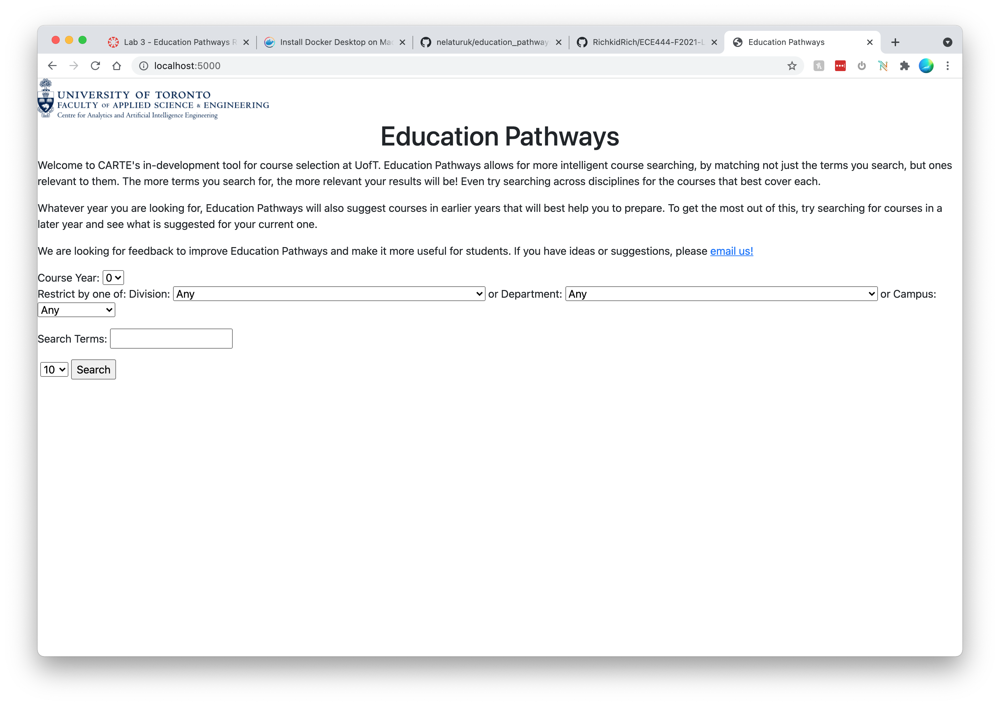
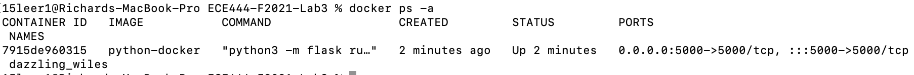

# ECE444-F2021-Lab3

##Richard Lee

this repo is a clone of https://github.com/nelaturuk/education_pathways

###Activity 1

###Activity 2

###Activity 3

###Activity 4

###Activity 5
####Functional Requirement
Display average student rating for each course when course list is rendered
####Non Functional Requirement
Search queries should have a maximum response time of 0.1 seconds from pressing the "search" button
####How I would improve the system
- Add nav bar to reduce clutter on the screen
- Add appropriate margins and padding to elements
- Add colour to the UI in general so that the website looks attractive

